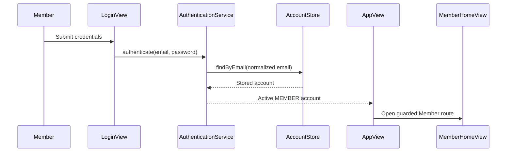
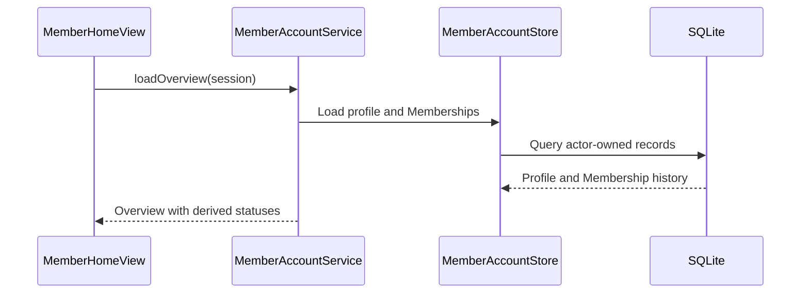
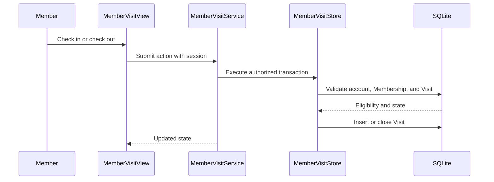
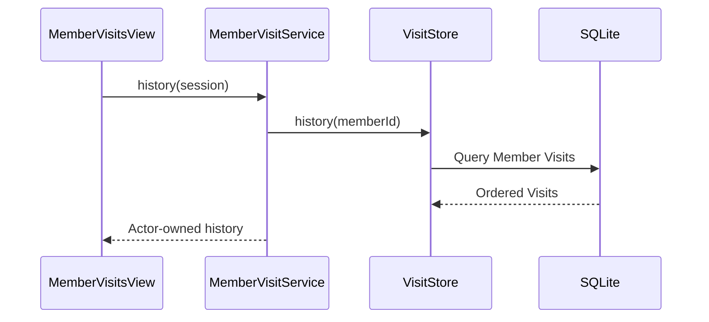
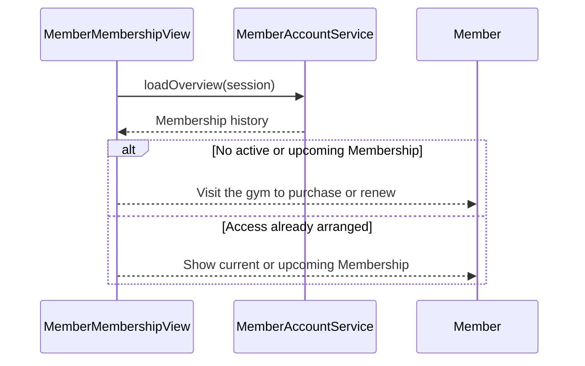
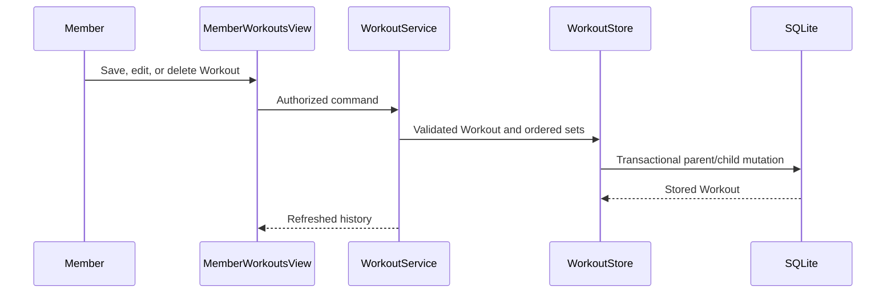
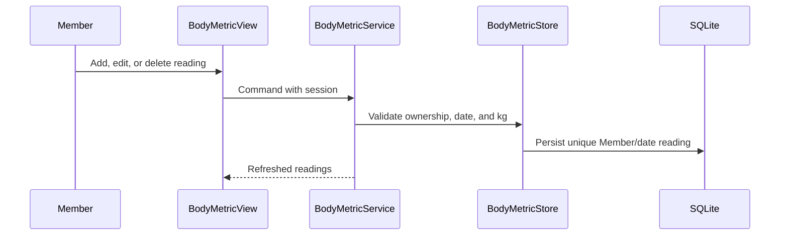
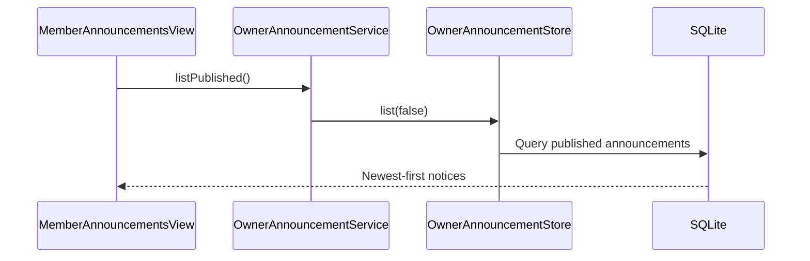
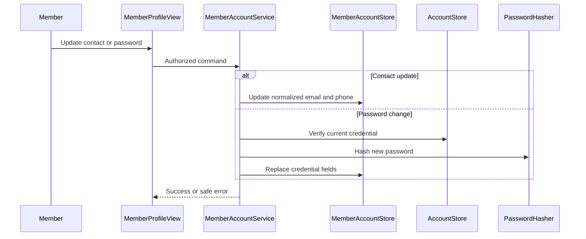
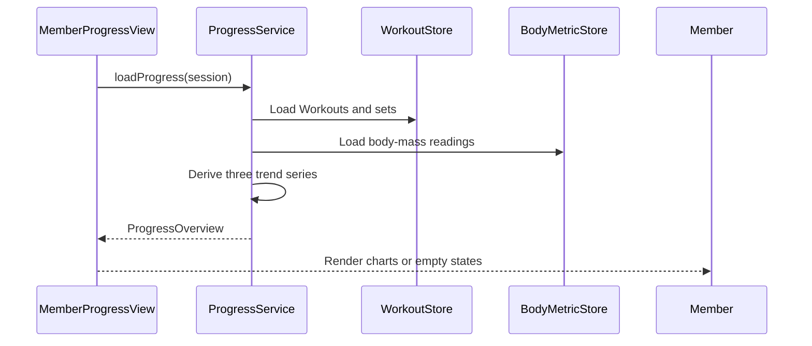

# Gym Member Feature Implementation Plan

## Summary

Implement every Member story in strict phase order:

1. Complete and verify all P0 features.
2. Complete and verify all P1 features.
3. Complete and verify P2.

Every feature below contains:

- Goal and measurable success criteria.
- Dependencies and reference files.
- New or changed classes and interfaces.
- A literal, ordered implementation procedure.
- Edge cases and expected tests written in English.
- A Mermaid sequence diagram.

Update `docs/UserStories.md` with clarified requirements when implementation begins, while leaving unimplemented stories marked `Planned`.

## User-story clarifications

- **M-P0-08:** Reword as an informational renewal flow. A Member with no current or upcoming Membership is told to visit the gym in person. No online payment, purchase request, or new Membership is created.
- **M-P1-01:** Multiple completed Workout sessions may be recorded on the same date. There are no draft Workouts.
- **M-P1-02:** Every Workout contains at least one ordered set. A set has an exercise name, exactly one positive measure—repetitions or duration—and optional non-negative resistance in kilograms.
- **M-P1-03:** Members may view, edit, and delete their own Workouts and sets.
- **M-P1-04:** A Member may store one positive body-mass reading per date and may edit or delete it.
- **M-P2-01:** Trends cover workout frequency, load volume, and body mass.

## Cross-cutting implementation rules

- Preserve `UI → service → store → SQLite`; views contain no SQL or authoritative business rules.
- Extract shared email, phone, and password validation so Owner and Member workflows cannot diverge.
- Pass the authenticated `Account` to Member service operations. Stores must verify that write operations belong to an active `MEMBER`.
- Inject `Clock` into new time-dependent services for deterministic testing; production constructors use the system clock and zone.
- Run database and hashing operations outside the JavaFX Application Thread.
- Add ordered, transactional schema migrations and include new tables in reset behavior.
- Store exercise resistance and body mass as integer grams; expose `BigDecimal` kilograms through services and UI.
- Reject future completed-Workout timestamps and future body-mass dates.
- Saved Workouts are completed records. Editing atomically replaces their set collection; deleting a Workout cascades to its sets.
- A valid Membership is required only for check-in. Other Member features remain accessible without a valid Membership.
- Complete each feature's models and persistence first, followed by services, automated tests, UI, manual verification, and documentation.
- Do not begin a later priority phase until the preceding phase gate passes.

### New focused types

- `MemberOverview`, `MemberVisitState`
- `MemberAccountService`, `MemberAccountStore`
- `MemberVisitService` and shared/Member Visit persistence
- `Workout`, `WorkoutSet`, `SaveWorkoutRequest`, `WorkoutSetInput`
- `WorkoutService`, `WorkoutStore`
- `BodyMetric`, `BodyMetricService`, `BodyMetricStore`
- `ProgressOverview`, `WorkoutFrequencyPoint`, `WorkoutVolumePoint`, `BodyWeightPoint`
- `ProgressService`

Do not introduce `MembershipPlan`, purchase-request, exercise-catalogue, generic metric, draft-Workout, or remote-API abstractions.

# P0 — Must have

## 1. Member authentication and guarded navigation — M-P0-01

### Goal

An active Member can use the normal login form, receives a Member session, and is routed to guarded Member screens. Owner login and authorization continue to work unchanged.

### Context files

- `AuthenticationService.java`
- `AccountStore.java`
- `LoginView.java`
- `AppView.java`
- `Screen.java`
- `AuthenticationServiceTest.java`
- `AppViewAuthorizationTest.java`

### Step-by-step implementation

1. Add `isMemberSession(Account)` beside the existing Owner-session check in `AppView`.
2. Add the required Member routes to `Screen`, initially pointing them to the existing Member Home placeholder.
3. Change the login success callback so it accepts any authenticated account instead of accepting only an Owner.
4. In `AppView`, inspect the authenticated account role and route `OWNER` to Owner Home and `MEMBER` to Member Home.
5. Guard every Member route with `isMemberSession`; redirect invalid sessions to login.
6. Keep every Owner-route guard unchanged and ensure Members cannot cross into Owner screens.
7. Replace the development-preview action with normal Member authentication behavior.
8. Ensure logout clears the shared session before returning to login.
9. Add service and route-authorization tests.
10. Manually verify Owner and Member login, logout, invalid credentials, and route separation.

### Tests and edge cases

- An active Member authenticates with the correct password and a trimmed, case-insensitive email.
- A Member is routed to Member Home while an Owner is routed to Owner Home.
- Unknown email, wrong password, and inactive account return the same public failure.
- Password character arrays are cleared after every outcome.
- A missing, Owner, or cleared session cannot open a Member route.
- A Member session cannot open an Owner route.
- Logout clears the session and protected routes return to login.
- Existing Owner setup, login, and reset behavior remains unchanged.

## 2. Profile, Membership details, and status — M-P0-02/M-P0-03

### Goal

Member Home and Membership screens display the authenticated Member's profile and complete Membership history with correctly derived statuses.

### Context files

- `Member.java`
- `Membership.java`
- `MembershipStatus.java`
- `OwnerMemberService.java`
- `OwnerMemberStore.java`
- `MemberHomeView.java`
- `OwnerMembersView.java`

### New types

- `MemberOverview`
- `MemberAccountService`
- `MemberAccountStore`
- `MemberMembershipView`

### Step-by-step implementation

1. Create `MemberOverview` containing the Member profile and ordered Membership history.
2. Create `MemberAccountStore` with a query that loads a Member profile by the authenticated account ID.
3. Add a second store query that loads only that account's Memberships, newest first with an ID tie-breaker.
4. Reject actors that are null, inactive, or not `MEMBER`.
5. Create `MemberAccountService.loadOverview(Account)` and derive statuses using an injected `Clock`.
6. Add `MEMBER_MEMBERSHIP` to `Screen` and guard it as a Member-only route.
7. Replace placeholder profile and Membership content in Member Home with loaded data.
8. Create `MemberMembershipView` to show complete Membership history and derived status.
9. Execute loading on a virtual thread and update JavaFX controls on the JavaFX thread.
10. Add service/store tests, then manually verify empty and populated states.

### Tests and edge cases

- A Member loads only their own profile and Memberships.
- Membership history is deterministically ordered newest first.
- Start and expiry dates are inclusive when deriving active status.
- Upcoming, expired, deactivated, and currently active periods display correctly.
- Empty Membership history displays an accessible empty state.
- Internal IDs and credential data are never displayed.
- Data remains correct after application restart.
- A null, Owner, inactive Member, or mismatched identity is rejected.

## 3. Check-in, check-out, and current state — M-P0-04/M-P0-05/M-P0-06

### Goal

An eligible Member can create exactly one open Visit, close that Visit later, and see a checked-in state derived from whether an open Visit exists.

### Context files

- `Visit.java`
- `GymFlowDatabase.java`
- `OwnerVisitService.java`
- `OwnerVisitStore.java`
- `OwnerMemberService.java`
- `OwnerVisitServiceTest.java`

### New types

- `MemberVisitState`
- `MemberVisitService`
- `MemberVisitStore`

### Step-by-step implementation

1. Extract or reuse one shared Membership-validity query so entry rules are not duplicated.
2. Create `MemberVisitStore.findOpenVisit(memberId)` and `MemberVisitStore.currentState(memberId)`.
3. Implement `checkIn` as one transaction that verifies an active Member, valid Membership on the current local date, and absence of an open Visit.
4. Insert an open Visit using `Clock.instant()` only after every eligibility check succeeds.
5. Retain the database partial unique index as the final duplicate-check-in safeguard.
6. Implement `checkOut` as one transaction that finds the Member's open Visit and records the exit instant.
7. Do not check Membership validity during check-out.
8. Create `MemberVisitService` to validate the actor and expose state, check-in, and check-out operations.
9. Connect Member Home buttons to background service calls and refresh state after success.
10. Disable only the action that is invalid for the displayed state, while retaining service-side enforcement.
11. Add transaction, constraint, authorization, and boundary-date tests.
12. Manually verify rapid repeated clicks and refresh behavior.

### Tests and edge cases

- An active Member with a valid Membership checks in successfully.
- Membership validity includes both start and expiry dates.
- Check-in fails for an inactive account or missing, upcoming, expired, or deactivated Membership.
- Duplicate and concurrent check-ins cannot create another open Visit.
- The unique database index independently prevents two open Visits.
- Check-out closes the open Visit with an exit not preceding entry.
- Check-out succeeds after Membership expiry or deactivation.
- Check-out without an open Visit fails without modifying history.
- Checked-in state is derived and never separately persisted.
- Failed operations roll back completely.
- One Member cannot check in or out another Member.

## 4. Visit history — M-P0-07

### Goal

Members can view only their own open and completed Visits, newest first, using the existing Visit formatting behavior.

### Context files

- `Visit.java`
- `VisitFormat.java`
- `OwnerVisitStore.java`
- `OwnerVisitsView.java`
- `OwnerMembersView.java`

### Step-by-step implementation

1. Move the reusable Member-history query into a shared Visit read component, or have Member persistence delegate to one shared implementation.
2. Keep Owner-only correction and global-search operations separate from Member history.
3. Add `MemberVisitService.history(Account)` with Member-role validation.
4. Add `MEMBER_VISITS` to `Screen` and its guarded navigation mapping.
5. Create `MemberVisitsView` using the existing Visit formatting utility.
6. Render completed Visits with exit and duration, and open Visits as currently inside.
7. Add an accessible empty state.
8. Load history off the JavaFX thread.
9. Add history isolation, ordering, formatting, and empty-state tests.
10. Confirm Owner Visit views and correction tests still pass.

### Tests and edge cases

- History contains only the authenticated Member's Visits.
- Completed and open Visits display correctly.
- Visits use deterministic newest-first ordering.
- Stored UTC instants display in the local time zone.
- Completed duration is correct.
- Open Visits display no completed duration.
- Empty history displays the correct empty state.
- Owner search and correction behavior remains unchanged.

## 5. In-person purchase and renewal guidance — M-P0-08

### Goal

A Member without a current or upcoming Membership sees a clear instruction to visit the gym in person. No purchase, payment, or request is recorded.

### Context files

- `Membership.java`
- `MembershipStatus.java`
- `MemberHomeView.java`
- `MemberMembershipView.java`
- `ProjectDecisions.md`

### Step-by-step implementation

1. Reuse the `MemberOverview` Membership history loaded by `MemberAccountService`.
2. Determine whether the history contains an active or upcoming Membership.
3. Show current Membership details when an active period exists.
4. Show upcoming Membership details and its start date when no active period exists but an upcoming period does.
5. Otherwise show the in-person purchase or renewal instruction.
6. Do not add a submit button, Membership mutation, payment flow, or request table.
7. Refresh the view when the Member reopens the screen so Owner-recorded changes appear.
8. Add decision-branch tests and a test proving that viewing guidance performs no write.
9. Update M-P0-08 wording and notes in `UserStories.md`.

### Tests and edge cases

- No Membership shows the in-person guidance.
- Expired-only or deactivated-only history shows the guidance.
- A current Membership suppresses the guidance.
- An upcoming Membership suppresses the guidance and shows its start date.
- The text contains no online-payment or contact-owner claim.
- Owner-created Membership changes appear after refresh.
- Viewing the guidance creates no database record.

### P0 completion gate

1. Run `gradlew.bat clean check`.
2. Resolve every P0 failure before continuing.
3. Manually verify Member and Owner login separation.
4. Verify Membership status on start and expiry boundary dates.
5. Verify duplicate check-in prevention and check-out after Membership deactivation.
6. Restart the application and confirm persistence.
7. Verify keyboard navigation, loading feedback, accessible labels, and light/dark themes.
8. Begin P1 only after all P0 checks pass.

# P1 — Should have

## 6. Completed Workout CRUD and history — M-P1-01/M-P1-02/M-P1-03

### Goal

A Member can create multiple completed Workouts per day, each containing at least one valid set, and can later view, edit, or delete their own Workouts.

### Data model

- `Workout`: ID, Member ID, start and end instants, optional notes, created time, updated time. The end is later than
  the start and cannot be in the future.
- `WorkoutSet`: ID, Workout ID, global display position, exercise name, nullable repetitions, nullable duration seconds, nullable resistance grams, created time, updated time.
- Exactly one of repetitions or duration is present and positive.
- Resistance is optional and non-negative.

### Context files

- `GymFlowDatabase.java`
- `MemberHomeView.java`
- `UiComponents.java`
- Existing service/store transaction implementations
- `ARCHITECTURE.md`

### Step-by-step implementation

1. Add immutable `Workout`, `WorkoutSet`, `SaveWorkoutRequest`, and `WorkoutSetInput` records.
2. Add `workouts` and `workout_sets` tables with foreign keys, check constraints, position constraints, and cascade deletion.
3. Add an ordered migration that preserves existing data and advances the schema version transactionally.
4. Add migration and reset tests before implementing service behavior.
5. Create `WorkoutStore.create`, `findByMember`, `findOwned`, `update`, and `delete`.
6. Make create and update transactional across the Workout and all sets.
7. For update, validate first, then replace the stored set collection inside the same transaction.
8. Create `WorkoutService` and centralize trimming, ownership, time, set-measure, and resistance validation.
9. Inject `Clock` into the service and reject invalid ranges and future Workout end times.
10. Add `MEMBER_WORKOUTS` to `Screen` and guarded navigation.
11. Create the Workout history view with newest-first cards.
12. Create one reusable Workout form for both create and edit.
13. Let the form add, remove, and reorder set rows before submission.
14. Represent repetitions and duration as mutually exclusive fields.
15. Execute save, update, delete, and reload work off the JavaFX thread.
16. Confirm deletion before calling the service.
17. Add service, migration, ownership, rollback, and UI-helper tests.
18. Update M-P1-01 through M-P1-03 notes in `UserStories.md`.

### Tests and edge cases

- A rep-based Workout with several exercises and sets saves and reloads unchanged.
- A duration-based Workout such as plank sets saves correctly.
- Rep-based and duration-based sets may coexist in one Workout.
- Optional resistance is accepted.
- Zero resistance is accepted; negative resistance is rejected.
- Exactly one of repetitions or duration is required and positive.
- A set containing both repetitions and duration is rejected.
- Blank exercise names and Workouts without sets are rejected.
- Multiple Workouts may be completed on the same date.
- A Workout with an end at or before its start, or a future end, is rejected.
- Names and notes are normalized correctly.
- History uses completion time and ID for deterministic ordering.
- Every editable field can be updated atomically.
- An invalid replacement set rolls back the entire edit.
- Deleting a Workout cascades only to its sets.
- One Member cannot access another Member's Workout.
- Workouts persist across restart and are removed by factory reset.
- Migration preserves all pre-existing application data.

## 7. Body-mass tracking — M-P1-04

### Goal

A Member can create, edit, view, and delete one positive body-mass reading per calendar date.

### Context files

- `GymFlowDatabase.java`
- Workout service/store conventions
- `MemberHomeView.java`
- `UiComponents.java`

### Step-by-step implementation

1. Add the immutable `BodyMetric` record.
2. Add a `body_metrics` table containing Member ID, measurement date, weight grams, and timestamps.
3. Add a unique constraint on Member ID plus measurement date.
4. Add positive-weight and valid-date service validation.
5. Add the schema change through the next ordered transactional migration.
6. Extend migration and reset tests before adding UI code.
7. Create `BodyMetricStore` CRUD methods with ownership checks.
8. Create `BodyMetricService` with injected `Clock` and kilogram-to-gram conversion.
9. Reject future dates and values with more than three decimal places.
10. Add a body-mass section to the Member Workout/Progress area without creating a generic metrics framework.
11. Create one form shared by add and edit.
12. Confirm deletion before invoking the service.
13. Refresh the list after each successful mutation.
14. Add validation, uniqueness, ownership, migration, and persistence tests.
15. Update M-P1-04 notes in `UserStories.md`.

### Tests and edge cases

- A positive reading stores and returns correctly in kilograms.
- Up to three decimal places round-trip without floating-point loss.
- Zero, negative, excessive-scale, missing, and future-dated readings are rejected.
- A second reading for the same Member and date is rejected.
- The database constraint independently enforces uniqueness.
- Different Members may record readings on the same date.
- Editing weight or date succeeds when the target date is free.
- Editing onto an occupied date fails without changing either reading.
- Deleting removes only the selected reading.
- A Member cannot access another Member's readings.
- Readings are newest first, persist after restart, and participate in reset.

## 8. Published announcements — M-P1-05

### Goal

Members see only currently published announcements, newest first, and may open each announcement to read its complete content.

### Context files

- `Announcement.java`
- `OwnerAnnouncementService.java`
- `OwnerAnnouncementStore.java`
- `OwnerAnnouncementsView.java`

### Step-by-step implementation

1. Reuse `OwnerAnnouncementService.listPublished()` as the existing shared read contract.
2. Do not expose publish, withdraw, or withdrawn-list operations in Member UI.
3. Add `MEMBER_ANNOUNCEMENTS` to `Screen` and Member navigation.
4. Create `MemberAnnouncementsView`.
5. Load published announcements off the JavaFX thread.
6. Render newest-first cards containing title, publication time, and a content preview.
7. Open a read-only detail view or dialog for complete content.
8. Add loading, empty, and safe-error states.
9. Add tests proving only published records are returned.
10. Manually publish and withdraw an announcement as Owner and verify the Member refresh result.

### Implementation notes

- The Member sidebar maps `Announcements` to `MEMBER_ANNOUNCEMENTS`; the shell maps that screen back to its
  navigation label before rendering. Both mappings are regression-tested so a missing case cannot leave the Member
  page unchanged after a click.
- Owner published-announcement cards include a visible `Withdraw` action. Withdrawn records stay in Owner history and
  disappear from the Member list after refresh.
- Announcement content opens in the same themed, scrollable JavaFX modal overlay used by other Member forms. It is
  read-only and supports long, Unicode, and multiline text. Its bold title wraps in full; cards use a single-line,
  ellipsized title and preserve the full title in the overlay.
- The announcement cards are ordinary fixed-height `VBox` nodes in the Member shell's vertical scroll container, not
  a nested `ListView`; the page therefore has no nested horizontal or vertical scrollbar.

### Tests and edge cases

- Published announcements appear newest first.
- Withdrawn announcements never appear.
- A withdrawn announcement disappears after refresh.
- Title, content, time, Unicode, and multiline content display correctly.
- Empty results show an accessible empty state.
- No read/unread state is created.
- Owner publishing and withdrawal remain unchanged.
- Member navigation resolves `MEMBER_ANNOUNCEMENTS` to the `Announcements` sidebar item.
- The announcement detail overlay inherits the active application theme and scrolls when content is long.
- Cards retain a consistent height, truncate long titles, and expose no horizontal or nested vertical scrollbar.
- Detail titles remain full, bold, and wrapped.
- Short announcement overlays retain a white light-theme surface rather than exposing the dialog background.
- Short announcement overlays use one consistent dark surface in dark mode, including the content, unused viewport,
  and Close-button bar.

## 9. Contact update and password change — M-P1-06/M-P1-07

### Goal

A Member can update only their email and phone number and can change their password after proving the current password.

### Context files

- `OwnerMemberService.java`
- `OwnerMemberStore.java`
- `AuthenticationService.java`
- `PasswordHasher.java`
- `AccountStore.java`
- `OwnerMemberServiceTest.java`

### Step-by-step implementation

1. Extract shared email normalization, phone normalization, and password-length rules from their duplicated locations.
2. Change existing Owner and authentication services to call those shared rules without altering current behavior.
3. Add `MemberAccountStore.updateContact` with active-Member ownership validation.
4. Add credential lookup and replacement operations needed for self-service password changes.
5. Implement `MemberAccountService.updateContact(Account, email, phone)`.
6. Ensure this method cannot accept or modify name, date of birth, or Member number.
7. Implement `MemberAccountService.changePassword(Account, currentPassword, newPassword)`.
8. Verify the current credential before hashing and storing the new password.
9. Clear both supplied password arrays in a `finally` block.
10. Add `MEMBER_PROFILE` to `Screen` and guarded navigation.
11. Create contact-edit and password-change forms.
12. Require matching new-password confirmation in the UI.
13. Preserve entered fields when validation or storage fails.
14. Refresh displayed contact information after success while keeping the current session active.
15. Add regression tests for existing Owner edit, Owner reset, and authentication behavior.

### Tests and edge cases

- Email is trimmed, lowercased, validated, and stored case-insensitively.
- Phone formatting and validation match the Owner workflow.
- Duplicate email fails without changing the profile.
- Member number, name, and date of birth cannot be changed.
- One Member cannot update another Member's profile.
- Correct current and valid new passwords replace the salted hash.
- Wrong current password produces a safe failure and leaves credentials unchanged.
- New passwords outside 12–128 characters are rejected.
- Confirmation mismatch is rejected before service submission.
- All password buffers are cleared on success and failure.
- The old password fails and the new password succeeds afterward.
- No Membership, Visit, Workout, body metric, or account-state record changes.
- The Member remains signed in after success.

### P1 completion gate

1. Run `gradlew.bat clean check`.
2. Resolve every P1 and regression failure.
3. Test migration from the current schema using populated Owner data.
4. Test multiple same-day Workouts containing rep-based and timed sets.
5. Test Workout and body-mass edit/delete behavior and ownership isolation.
6. Test body-mass date uniqueness at service and database levels.
7. Test announcement withdrawal visibility.
8. Test profile normalization and credential replacement.
9. Restart the application and confirm persistence.
10. Verify scrolling, forms, keyboard navigation, loading states, and light/dark themes.
11. Begin P2 only after all P1 checks pass.

# P2 — Could have

## 10. Workout and body-weight trends — M-P2-01

### Goal

A Progress screen derives and displays:

- Completed-Workout count per date.
- Load volume per Workout.
- Body-mass readings over time.

Load volume is the sum of `repetitions × resistance kg` for weighted rep-based sets. Timed, unweighted, and zero-resistance sets contribute zero.

### Context files

- `Workout.java`
- `WorkoutSet.java`
- `BodyMetric.java`
- Their stores and services
- `MemberHomeView.java`
- JavaFX chart controls

### New types

- `ProgressOverview`
- `WorkoutFrequencyPoint`
- `WorkoutVolumePoint`
- `BodyWeightPoint`
- `ProgressService`
- `MemberProgressView`

### Step-by-step implementation

1. Add immutable projection records for the three trend series.
2. Add read queries that load the authenticated Member's Workouts, sets, and body-mass readings in deterministic order.
3. Do not add a trend table or persist calculated totals.
4. Implement `ProgressService.loadProgress(Account)`.
5. Group Workouts by local calendar date and count them for frequency points.
6. Calculate each Workout's load volume using `BigDecimal`.
7. Exclude timed sets and sets without positive resistance from load volume.
8. Map body-mass records into chronological points.
9. Return all three series in `ProgressOverview`.
10. Add `MEMBER_PROGRESS` to `Screen` and guarded navigation.
11. Create JavaFX charts for frequency, load volume, and body mass.
12. Provide explicit empty and insufficient-data states rather than showing broken charts.
13. Reload trends whenever the Progress screen opens so edits and deletions are reflected.
14. Add pure calculation tests before UI integration.
15. Add service ownership and ordering tests.
16. Manually verify charts with empty, single-point, multiple-date, and multiple-Workout datasets.
17. Update M-P2-01 wording and notes in `UserStories.md`.

### Tests and edge cases

- Multiple same-day Workouts aggregate into the correct daily frequency.
- Workouts on different dates produce ordered frequency points.
- Load volume sums every weighted rep-based set correctly.
- Timed, unweighted, and zero-resistance sets add zero load volume.
- Multiple Workouts on one date remain distinct volume points.
- Body-mass points are chronological and unique by date.
- Trends contain only the authenticated Member's records.
- Workout and body-mass edits appear after refresh.
- Deleted records disappear from trends.
- Empty and single-point datasets render without errors.
- Calculations use `BigDecimal` without binary floating-point errors.
- Stable ordering is retained when timestamps match.
- No calculated trend data is persisted.

## Documentation and final acceptance

1. Update `docs/UserStories.md` with the clarified story wording and notes.
2. Keep stories marked `Planned` until their implementation and phase gate are complete.
3. During implementation, update `docs/UserGuide.md`, `docs/DeveloperGuide.md`, and `ARCHITECTURE.md` as behavior becomes available.
4. After each feature, run its focused tests before running the complete suite.
5. Final acceptance requires `gradlew.bat clean check`, migration/reset coverage, no Checkstyle failures, no Owner regressions, and manual verification using the matching platform JAR.

## Assumptions

- Existing Owner-created active Member accounts are used; self-registration remains out of scope.
- M-P0-08 is informational only and creates no Membership, payment, request, or plan.
- The local computer's date and time zone is used until an authoritative gym timezone is agreed.
- Resistance and body mass are displayed in kilograms and stored as integer grams.
- Workout and body-mass deletion is permanent because these are Member-controlled personal tracking records.
- Memberships, Payments, Visits, and Owner records retain their existing historical rules.
