# GymFlow User Guide

GymFlow is a JavaFX desktop application for managing a small gym. This guide describes only features present in the
current release.

To try every feature with disposable data, start with the [local walkthrough](#step-by-step-local-walkthrough).
To check the hosted application, use the [production smoke test](#production-smoke-test).

## Requirements

- Java SE 25
- A supported Windows x64, Linux x64, macOS x64, or macOS ARM64 computer
- Internet access to the configured GymFlow service

## Starting GymFlow

For an already configured installation, download the JAR matching your operating system and processor architecture,
then run it from a terminal:

```shell
java -jar GymFlow-macos-arm64.jar
```

Replace the filename with the JAR downloaded for your platform. The application requires access to its configured
GymFlow backend to sign in. If you are starting from this repository, follow the local or production instructions
below to configure that connection first.

GymFlow also creates rotating diagnostic files named `gymflow-0.log` through `gymflow-2.log` in the local
`data/logs/` directory. If the application exits unexpectedly, include these files when reporting the problem. They
contain startup events and sanitized error types, not passwords or values entered into forms.

## Signing in

Every installation opens on the same GymFlow sign-in screen.

1. Enter the Owner or Member email address provisioned by the gym.
2. Enter the account password.
3. Select `Sign In`.

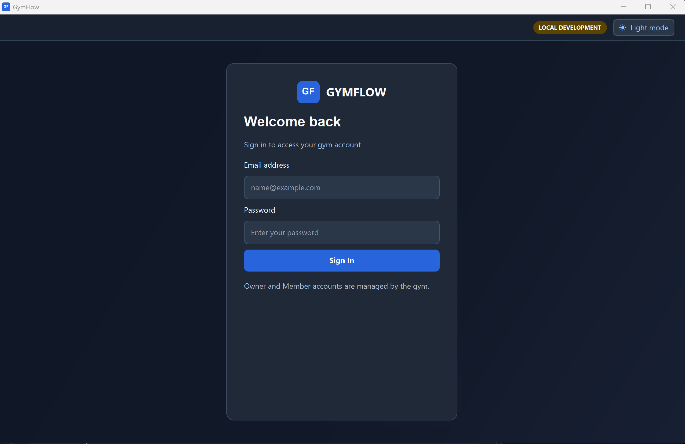

After authentication, GymFlow loads the account's role and opens Owner Home or Member Home. Invalid credentials
display `Invalid email or password` without identifying which value was incorrect. A backend outage displays a
connection error instead.

Owner's Hompage:
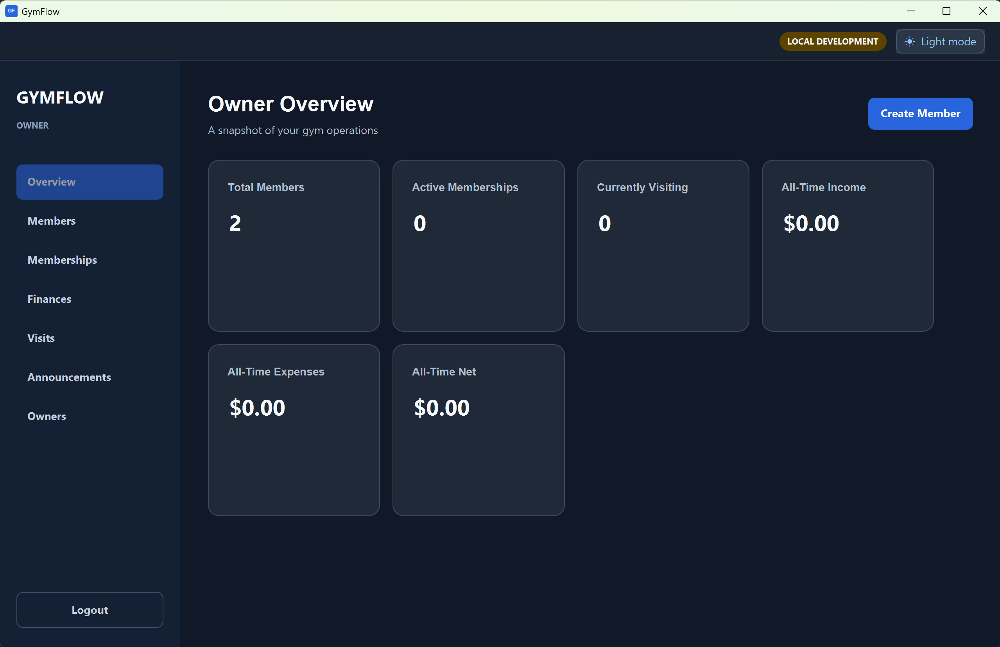

Mmeber's Homepage:
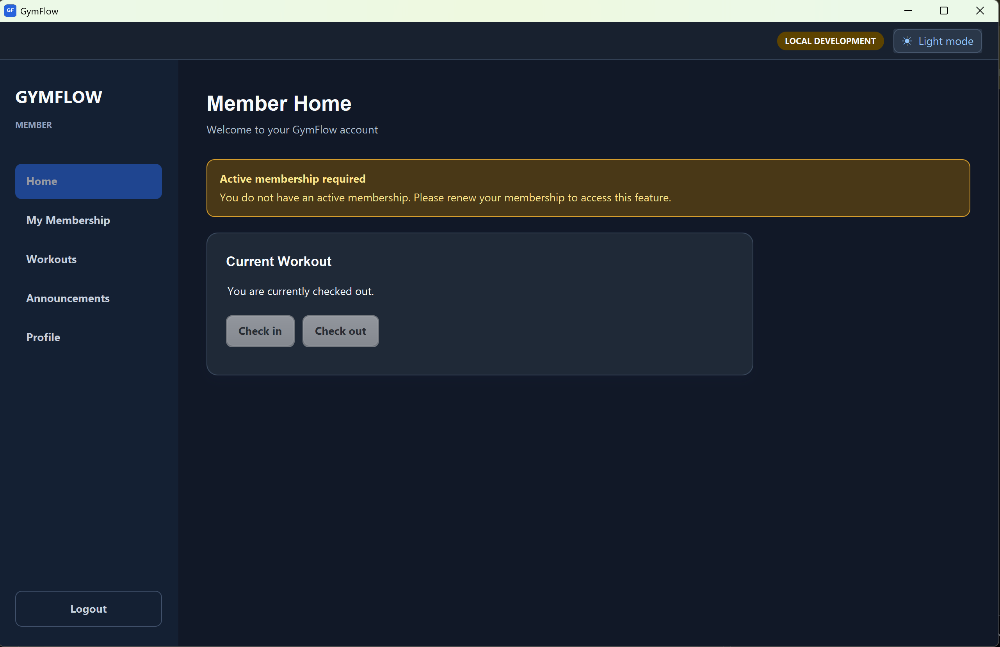

## Owner login and logout

Select `Logout` in the Owner sidebar and confirm the dialog to clear the current session.

## Managing Owners

Open `Owners` from the Owner sidebar to view every gym administrator. Select `Add Owner`, enter the co-owner's real
email address and a temporary password, then enter your own current password to authorize the change. Send the
temporary password to the co-owner through a secure channel separate from their username.

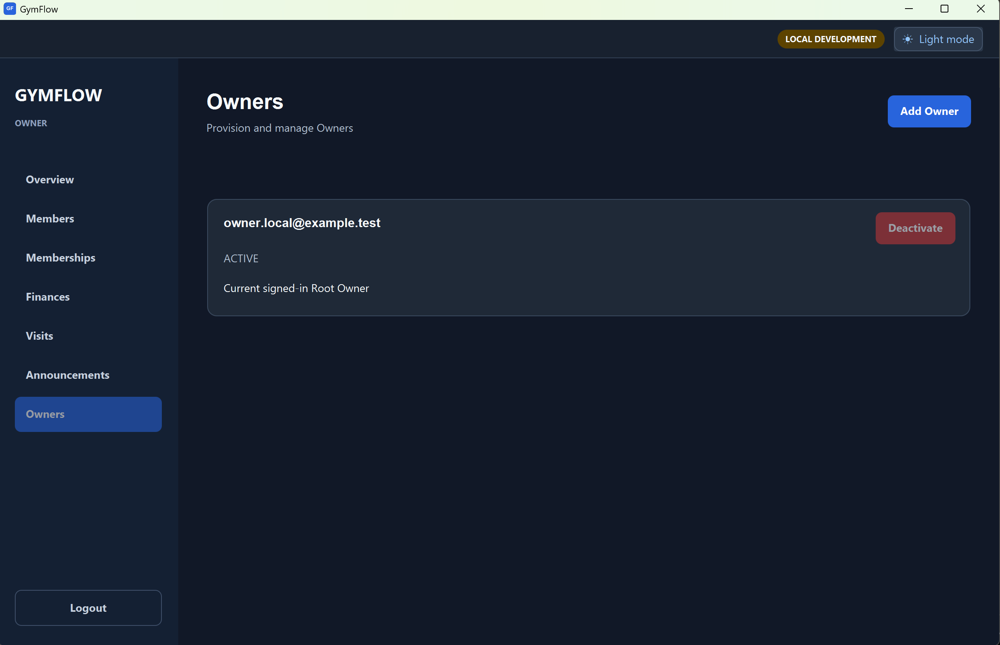

An email address can belong to only one GymFlow account, without regard to capitalization or surrounding spaces. An
email already used by a Member cannot be reused for an Owner, and an Owner email cannot be reused for a Member.

Use `Deactivate` to prevent another Owner from accessing GymFlow and `Activate` to restore access. Each change again
requires your current password. You cannot change your own active status from this page, and GymFlow will never allow
the final active Owner to be deactivated. Owner creation and activation changes are retained in an administrative
audit record.

## Light and dark themes

Use `Dark mode` or `Light mode` at the top-right of the window to change the appearance of GymFlow. The control is
available on every screen, including Login. GymFlow stores the selection locally and restores it on future launches.
Changing the theme does not affect gym records or other installations of the application.

## Owner Home

Owner Home displays the total number of registered Members, the number of Members with a currently valid active
Membership, the current visitor count, all recorded income and expenses, and their calculated net. Financial values
are displayed in SGD and cover all records currently stored in GymFlow. The six summary cards resize and wrap with
the available window width.

Select `Members` to open Member management, `Memberships` to review all purchased Membership periods, `Finances` to
review membership income and operating expenses, `Visits` to review attendance, or `Announcements` to manage gym
notices. Select `Create Member` to open the creation form directly; after a successful creation, GymFlow opens the
Members page.

## Managing Members

The Members page lists each Member's number, name, email, and phone number. Enter all or part of a Member's name or
email and select `Search`, or press Enter in the search field. A blank search displays every Member again.

Select `Export CSV` to save exactly the Member cards currently displayed. This means a search can be used to export a
subset. The export contains Member number, name, email, phone number, and date of birth; it excludes passwords and
internal database IDs.

### Creating a Member

1. Select `Create Member`.
2. Enter the Member email, initial password, profile information, membership dates, and payment information.
3. Re-enter the initial password and select `Create Member`.

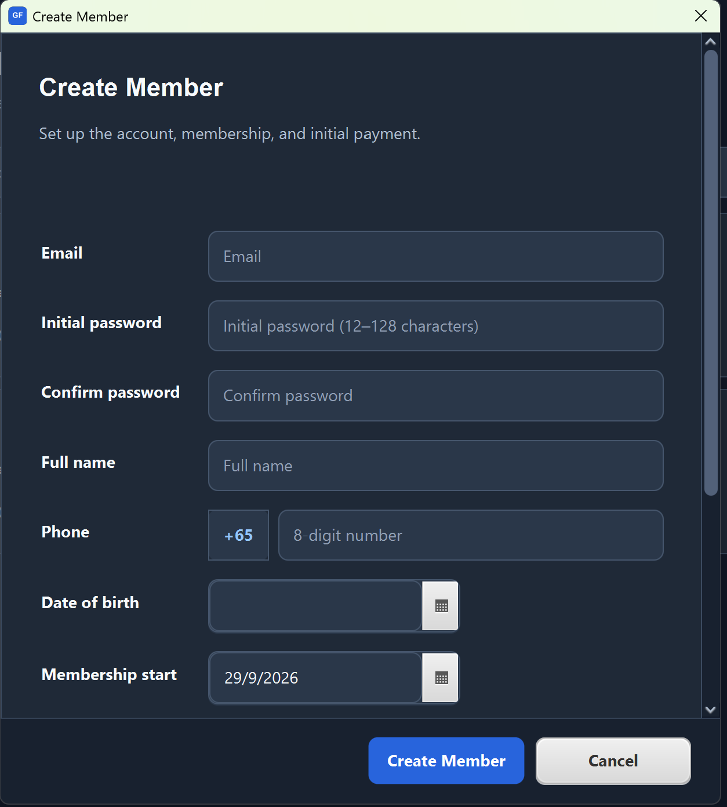

The password must contain 12–128 characters. GymFlow currently supports Singapore phone numbers only: enter eight
digits beginning with `3`, `6`, `8`, or `9`; the fixed `+65` prefix is stored automatically. Date of birth is optional,
but a supplied date must show that the Member is at least 12 years old. Membership expiry cannot precede its start, and
the SGD payment must be positive with at most two decimal places.

The Member email must not already belong to any Owner or Member account. Email matching is case-insensitive and
ignores surrounding spaces.

GymFlow assigns the next number such as `M000001`. Account, profile, Membership, and Payment creation succeed together;
an error creates none of them. Validation and storage errors appear in the form without closing it or clearing entered
values. Give the initial password to the Member securely outside GymFlow.

### Editing a Member

Select a Member card to open the Member profile page. The profile page shows the Member number, contact details,
Membership history, Visit history, and read-only Payment history. Select `Back to Members` to return to the list.

Select `Edit` on the profile page to update email, full name, phone number, and optional date of birth. The edit view
keeps payment history visible but read-only. Select `Cancel` to discard changes or `Save Changes` to persist them.
Phone numbers and dates of birth follow the same validation rules as creation. The Member number cannot be changed. A
validation failure remains on the edit page for correction.

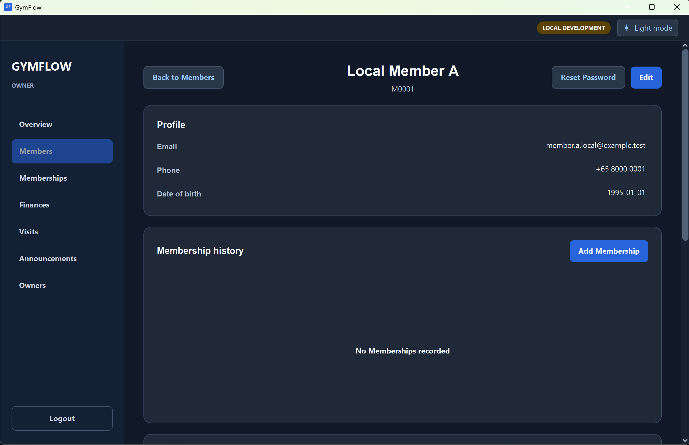

### Resetting a Member password

The Owner sets and confirms the initial password while creating a Member and must communicate it securely outside
GymFlow. To replace it later, open the Member profile, select `Reset Password`, and enter the new password twice. The
new password must contain 12–128 characters. Validation or storage errors remain in the dialog so they can be
corrected without reopening it.

The Owner does not need to enter their own password again because this action is available only inside an authenticated
Owner session. A successful reset replaces the old Member password without changing the Member's profile, account
activity, Memberships, Payments, or Visits. Members can then sign in with the replacement password using the normal
login screen.

## Managing Memberships

The Memberships page lists every purchased period with its Member, start date, expiry date, and derived status. Search
by Member name or email, select `Search`, or press Enter. Clearing the search displays all Memberships again.

From a Member profile, select `Add Membership` to record another access period and its Payment. Dates are selected from
the calendar controls. The suggested start is the day after the latest active period expires, or today when none
exists; the suggested expiry is one month later. Enter a positive SGD amount, choose `CASH`, `CARD`, or `TRANSFER`, and
optionally enter a reference.

Active Membership periods cannot overlap. A deactivated period may be replaced by a new overlapping period. Use the
`Deactivate` action on a Membership card to stop it granting gym access without disabling the Member account or removing
history. A current or future deactivated period may be reactivated when it does not overlap another active period.
Expired periods cannot be reactivated; add a new Membership instead.

If a Membership is deactivated while the Member is already inside the gym, their ongoing Visit remains open. They
remain listed under `Currently Visiting` and included in the current visitor count until they submit an exit. GymFlow
does not create an artificial exit time; deactivation only prevents the Membership from authorizing a future entry.

Statuses are calculated from the active flag and dates: `ACTIVE`, `UPCOMING`, `EXPIRED`, or `DEACTIVATED`.

## Managing Finances

The Finances page separates records into `Income` and `Expenses` tabs. Income lists every recorded membership Payment
with its Member, Membership period, SGD amount, method, payment time, and optional reference. Search by Member name or
email and select `Search`, or press Enter. Clearing the search displays every Payment again.

The Expenses tab lists operating expenses by date, amount, method, category, and optional description. Choose a
category or `All Categories` to filter the cards. To add an expense:

1. Select `Add Expense` in the Expenses tab.
2. Select today or an earlier date from the calendar.
3. Enter a positive SGD amount with at most two decimal places.
4. Choose `CASH`, `CARD`, or `TRANSFER` and an expense category.
5. Optionally enter a description, then select `Add Expense`.

Supported categories are `MAINTENANCE`, `UTILITIES`, `EQUIPMENT`, `SUPPLIES`, `RENT`, and `OTHER`. Expenses currently
support creation and viewing only; they cannot be edited, deleted, or exported. Income is also read-only. While the
Income tab is selected, use `Export CSV` to save exactly the Payment cards currently displayed after searching.
Refunds are not available.

## Managing Announcements

The Announcements page separates notices into `Published` and `Withdrawn` tabs. Select `Publish Announcement`, enter
a required title and content, then publish it. Validation errors remain in the dialog without clearing the entered
text. Select a card to read the complete announcement. Published cards also provide a `Withdraw` action.

From a published announcement's detail page, select `Withdraw` and confirm to stop displaying it to Members. Withdrawn
notices remain available to the Owner as read-only history. Announcements cannot be edited or permanently deleted;
publish a replacement when a notice needs correction.

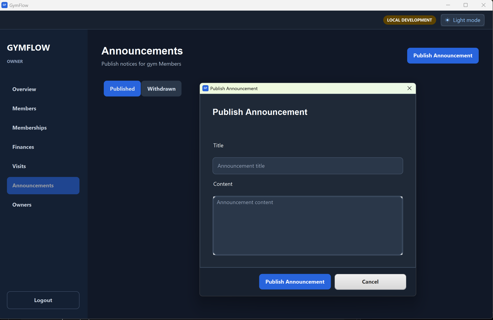

Members open `Announcements` from the left sidebar to view currently published notices, newest first. The cards have
a consistent size with a single-line, ellipsized title; the page uses only its normal vertical scroll. Select an
announcement card to open its complete content in a themed, scrollable read-only overlay, where the full bold title
wraps across lines. Short overlays keep a clean white surface in light mode. Select `Refresh` to reflect an Owner
withdrawal; withdrawn notices are never shown to Members. In dark mode, the overlay uses one consistent dark surface.

## Reviewing Visits

The Visits page provides two tabs. `All Visits` contains completed and ongoing visits, while `Currently Visiting`
contains only Members whose Visit has no exit time. Search by Member name or email and select `Search`, or press Enter.
Clearing the search restores all records in the selected tab.

Select `Export CSV` to save exactly the Visit cards displayed in the selected tab. `All Visits` and `Currently
Visiting` therefore produce separate snapshots, and a search can further limit either export.

Each card shows the Member number and name, entry time, exit time, and duration. An ongoing Visit displays
`Currently inside` and `Ongoing`. Times use the computer's local time zone. The same read-only history is available
from the Member's profile page.

To correct a record, select `Correct` on its card. The Owner may change its entry time and may add,
change, or clear its exit time. Every correction requires a reason. Clearing the exit marks the Member as currently
inside and is rejected if that Member already has another open Visit. Previous correction information is shown when
the record is corrected again; GymFlow retains the latest correction rather than a complete audit history. Owners
cannot create new Visits directly.

CSV exports use portable ISO dates and UTC timestamps. Open Visits leave exit and duration cells blank. GymFlow asks
where to save each UTF-8 `.csv` file and safely escapes commas, quotation marks, line breaks, Unicode text, and values
that spreadsheet applications could otherwise interpret as formulas. Canceling the save window creates no file.

## Member dashboard

After signing in, Members can review their profile, Membership history, Membership status, and current Workout state.
The dashboard displays an active Membership when one is valid today; otherwise, it displays the next upcoming
Membership and its start date.

When there is no current or upcoming Membership, a prominent amber `Membership renewal needed` notice appears at the
top of Member Home, before the check-in controls. It explains that gym check-in is unavailable and directs the Member
to visit the gym in person to purchase or renew. The same guidance appears on `My Membership`; historical expired and
deactivated periods remain visible there. This guidance is informational only: it does not create a Membership,
Payment, or online purchase request.

## Managing Workouts

Check in from `Home` to start a Workout. Confirming check-in records its exact start time. While checked in, add
exercises and sets beneath the current Workout status; navigating to another Member tab saves that draft automatically.
Check out confirms and atomically saves the displayed draft before recording the exact end time. Check-out requires at
least one full minute after check-in. Empty Workouts and exercises with missing set measures may be saved and completed.

Open `Workouts` in the Member sidebar to review completed sessions. Empty Workouts show `No exercises recorded`. The current open Workout is not shown there. The
month calendar uses blue for a date with one Workout and green for a date with multiple Workouts. Use the month arrows
to review other months.

Select a blue date to open that Workout's existing edit form. Members can update notes, exercises, and sets, but the
recorded date and times are displayed read-only and Workouts cannot be deleted. Select a green date to open an overlay
listing that date's sessions from earliest start time to latest. Dates with no recorded Workout are not actionable. An
overnight Workout remains on the selected end date.

## Tracking Body Mass

Open `Workouts`, then select `Body mass`. The Measurements page shows the latest weight, the change since the prior
reading, and a trend chart. Use the chart selector for 1 month, 3 months, 6 months, 1 year, or all recorded history.
Select `Custom` to reveal inclusive start and end dates beside the control; select it again to hide them. Enter today's
weight and select `Save reading` for the usual daily update. Choose `Change date` only when recording or correcting a
past reading; it opens the calendar directly. Select an item in Weight history to edit or delete it. Each Member can
have one positive body-mass reading per date.

## Shared-data safety

The former installation-wide `Reset GymFlow` action is unavailable. GymFlow now uses shared cloud data, so a reset on
one computer could affect every Owner and Member. Production deletion or restoration must be server-authorized,
explicitly scoped, backed up, and tested separately.

## Step-by-step local walkthrough

Use this sequence for a complete feature test. Local data is disposable; `npm run supabase:reset` replaces it with the
committed seed. Run commands from the repository root. Install Java 25, Node.js/npm, and Docker Desktop first.

1. Start Docker Desktop. In terminal 1, run `npm install`, `npm run supabase:start`, then
   `npm run supabase:reset`. Keep the local backend running.
2. In terminal 2, run `npm run supabase:functions` and leave it running.
3. In terminal 3, run `./gradlew runLocal` (Windows: `.\gradlew.bat runLocal`). Confirm the sign-in screen shows
   `LOCAL DEVELOPMENT`. A fresh clone has no `data/gymflow.db` requirement: step 1 created and seeded the local
   Supabase database. Sign in with the seeded Owner below; there is no first-run Owner creation screen. To create
   another Owner, use the `Owners` page after signing in.

| Seeded role | Email | Password |
| --- | --- | --- |
| Owner | `owner.local@example.test` | `LocalOwner!2026` |
| Member A | `member.a.local@example.test` | `LocalMemberA!2026` |
| Member B | `member.b.local@example.test` | `LocalMemberB!2026` |

4. Sign in as the seeded Owner. Check the six [Owner Home](#owner-home) summaries. Toggle the theme and confirm it
   remains selected after restarting the app.
5. Open `Owners` and create a co-owner with email `owner.tour@example.test` and password `OwnerTour!2026`.
   Enter the seeded Owner password to authorize creation. Log out, sign in as the new co-owner, then log
   out and return to the seeded Owner. Test deactivation and reactivation of the new co-owner; verify deactivation
   blocks a fresh sign-in. The seeded Owner cannot deactivate itself or the last active Owner. See
   [Managing Owners](#managing-owners).
   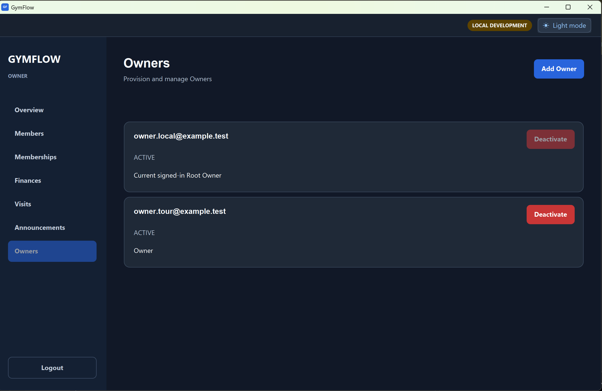
6. Open `Members` and create a Member with email `member.tour@example.test`, password `MemberTour!2026`, valid
   profile details, a Membership covering today, and a positive payment. Do not reuse the seeded Member emails.
   Check search, the Member profile and edit form, and `Export CSV`. Reset this Member's password to
   `MemberReset!2026`; use that password when signing in later. See [Managing Members](#managing-members).

   Result:
   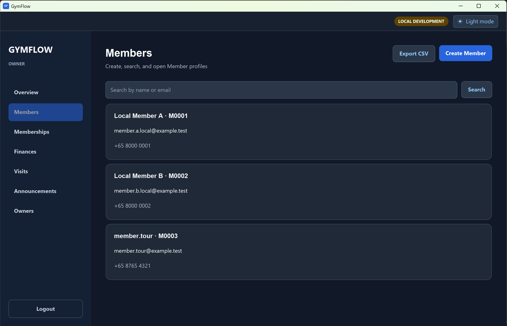
7. From that Member profile, add a future nonoverlapping Membership and payment. Check `Memberships` search and
   statuses. Test deactivation and reactivation on the future period. On `Finances`, check the new income, search and
   CSV export, then add an expense and filter by category. See [Managing Memberships](#managing-memberships) and
   [Managing Finances](#managing-finances).

   Membership page:
   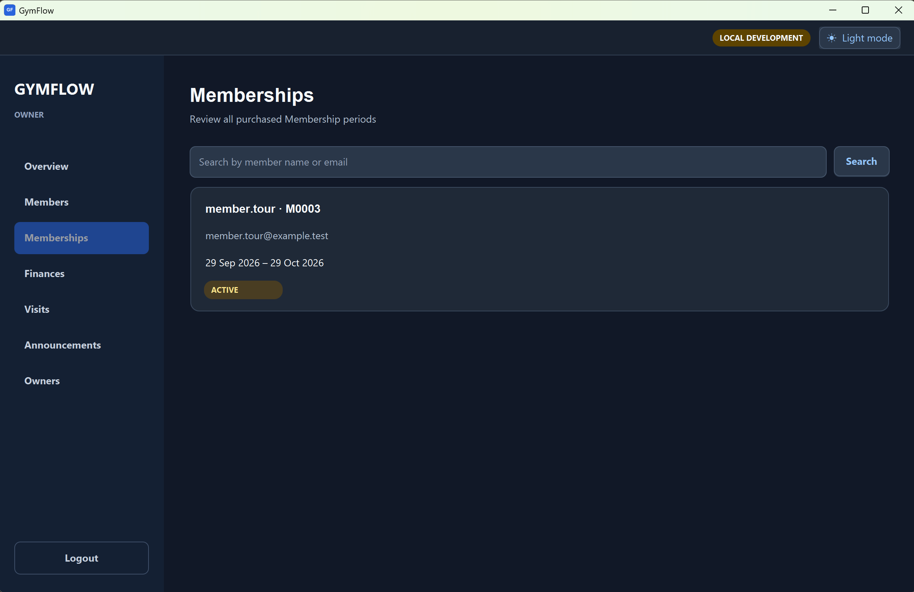

   Finances page:
   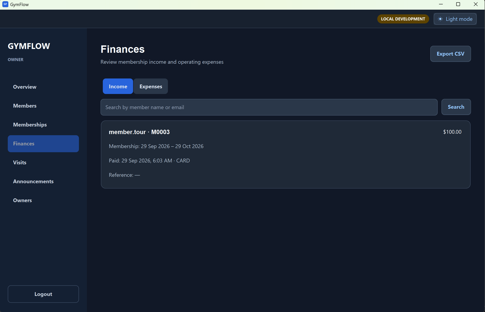

8. Publish an announcement and open its detail. Log out, sign in as the new Member, and confirm it appears. Log out
   and sign in as Owner to withdraw it. Sign in as the Member again, select `Refresh`, and confirm it disappears.
   See [Managing Announcements](#managing-announcements).

   Member's view of announcements published:
   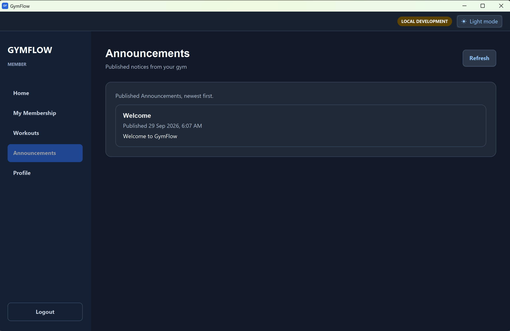

9. As the new Member, check Home, `My Membership`, and profile. Check in, add a Workout note, exercise, and sets,
   navigate away and back to confirm the draft remains. After at least one minute, check out. Review the completed
   Workout on its calendar date and edit its notes or sets. See [Member dashboard](#member-dashboard) and
   [Managing Workouts](#managing-workouts).
10. Open `Workouts` > `Body mass`; save today's reading, add a past reading through `Change date`, and try the chart
    ranges and history edit. Check in again, then sign in as Owner in a second app process. Under `Visits`, confirm
    the Member appears in `Currently Visiting`. After the Member checks out, review `All Visits`, search for that
    Member, correct a Visit with a reason, and export CSV. See
    [Tracking Body Mass](#tracking-body-mass) and [Reviewing Visits](#reviewing-visits).

    Body Mass Tracking:
    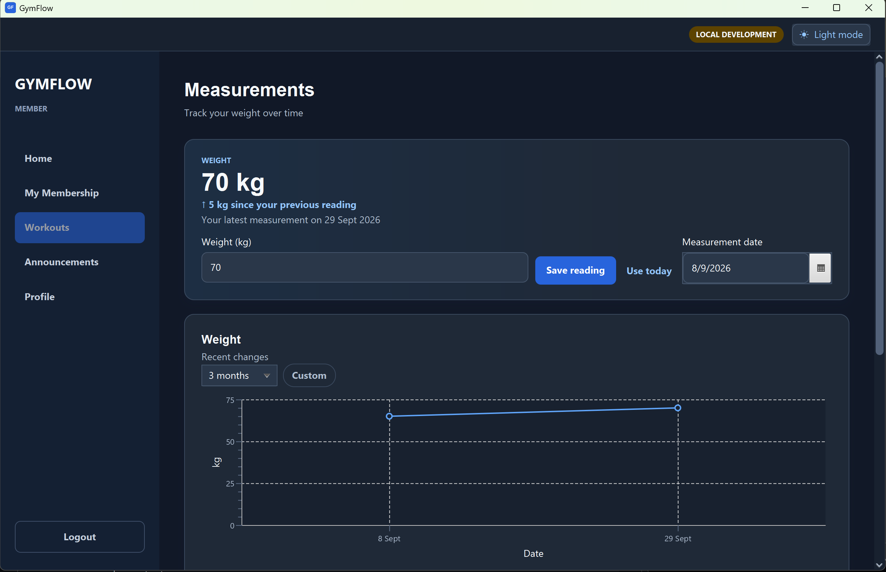

11. Restart GymFlow and sign in as the new Member to confirm the records persist. In a second app process, sign in as
    seeded Member B; verify the new Member's profile, Workouts, and measurements are absent. Log out from each role and
    confirm the logout dialog.

For the no-Membership state, create another Member whose Membership has already expired, or deactivate a current
Membership and ensure that Member has no other current or upcoming period. Home and `My Membership` should show renewal
guidance and block check-in. Reset the local database to repeat the walkthrough from the original seed.

### Automated local checks

With the local backend and Edge Function running, run `npm run supabase:test`, `npm run supabase:lint`, and
`./gradlew verifyLocal` (Windows: `.\gradlew.bat verifyLocal`). `verifyLocal` includes Java tests, Checkstyle,
rendered UI checks, and release JAR verification; it needs an active desktop session.

## Production smoke test

Production is shared. Test sign-in and Owner Home only; use the local walkthrough for changes to records. Contact
Telegram `@ITZXITZX` for the Supabase **publishable** key if needed. The shared test co-owner account is:

| Role | Email | Password |
| --- | --- | --- |
| Production test co-owner | `test@example.com` | `Test1234567890!` |

The shared credential is public; it must not be used to protect real gym data. If it no longer works, request a
current test account from the maintainer. Set `GYMFLOW_ENV=production`,
`GYMFLOW_SUPABASE_URL=https://ixbhtfqsznxteurqmguw.supabase.co`, and `GYMFLOW_SUPABASE_PUBLISHABLE_KEY` in the
launching terminal. Follow the exact [README Windows or macOS commands](../README.md#live-production---windows),
sign in, confirm Owner Home loads, then close the app and clear the variables. A production Member account is not
prepublished; test Member flows locally. Never use a secret or legacy `service_role` key in the desktop app.
